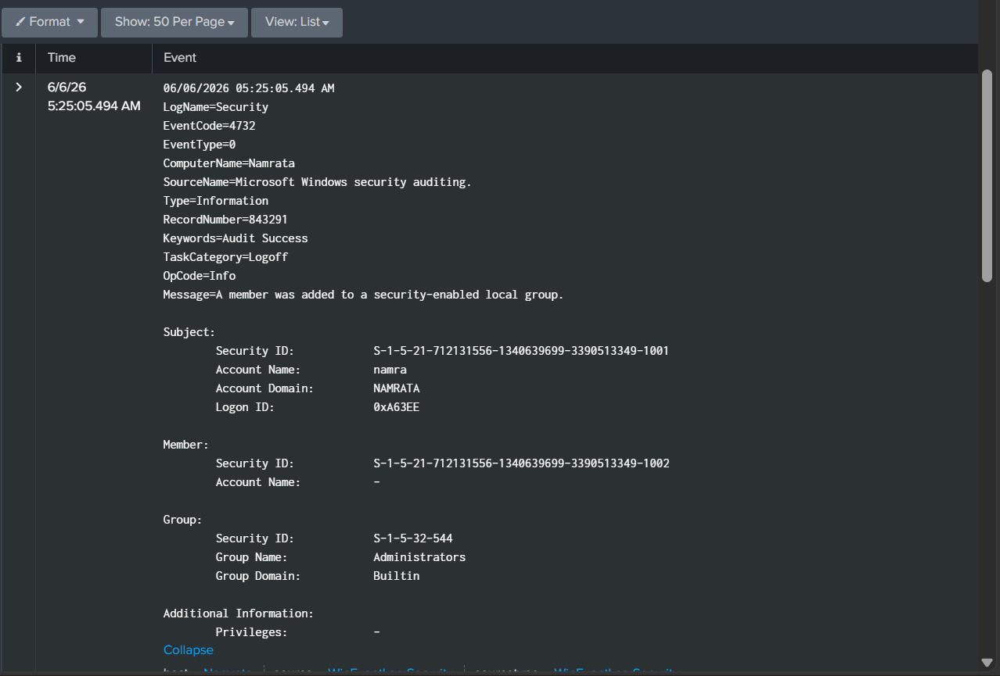

# Local Group Membership Modification Detection

## Objective
Detect and investigate local group membership changes on Windows systems that may
indicate privilege escalation, persistence, or unauthorized account manipulation —
particularly additions to the built-in Administrators group.

---

## Event ID & Data Source
| Event ID | Log Source | Description |
|----------|------------|-------------|
| 4732 | Windows Security Log | A member was added to a security-enabled local group |
| 4733 | Windows Security Log | A member was removed from a security-enabled local group |
| 4720 | Windows Security Log | A user account was created (correlate) |
| 4624 | Windows Security Log | Successful logon (correlate) |

---

## Environment
| Field | Value |
|-------|-------|
| Computer Name | Namrata |
| Domain | NAMRATA |
| Log Source | WinEventLog:Security |
| Source Name | Microsoft Windows Security Auditing |
| Keywords | Audit Success |
| Task Category | Logoff |
| Detection Date | 06/06/2026 |
| Record Number | 843291 |

---

## SPL Query

### Basic Detection
```spl
source="WinEventLog:Security" EventCode=4732
| table _time, ComputerName, Account_Name, Message
| sort - _time
```

### Filter — Additions to Administrators Group Only (high priority)
```spl
source="WinEventLog:Security" EventCode=4732
| search Message="*Administrators*"
| table _time, ComputerName, Account_Name, Message
| sort - _time
```

### Full Correlated Attack Chain Query
```spl
source="WinEventLog:Security" EventCode IN (4720, 4625, 4624, 4732)
| eval Action=case(
    EventCode=4720, "Account Created",
    EventCode=4625, "Failed Login",
    EventCode=4624, "Successful Login",
    EventCode=4732, "Added to Admin Group")
| table _time, EventCode, Action, Account_Name, ComputerName
| sort _time
```

### Alert — Any Account Added to Privileged Groups
```spl
source="WinEventLog:Security" EventCode=4732
| search Message="*Administrators*" OR Message="*Remote Desktop Users*"
  OR Message="*Backup Operators*"
| stats count by Account_Name, ComputerName
| where count >= 1
```

---

## Real Log Analysis

### What Was Detected
On **06/06/2026 at 05:25:05 AM**, account `namra` added the account with SID
`S-1-5-21-712131556-1340639699-3390513349-1002` (which is `testuser`) to the
built-in **Administrators** group on machine `Namrata`. This is the final and most
critical event in a full attack chain spanning over 12 hours.

### Log Details
| Field | Value |
|-------|-------|
| EventCode | 4732 |
| Time | 06/06/2026 05:25:05 AM |
| Message | A member was added to a security-enabled local group |
| Subject Account | namra |
| Subject Domain | NAMRATA |
| Subject Security ID | S-1-5-21-712131556-1340639699-3390513349-1001 |
| Subject Logon ID | 0xA63EE |
| Member Security ID | S-1-5-21-712131556-1340639699-3390513349-1002 |
| Member Account Name | — (resolved via SID to testuser) |
| Group Name | Administrators |
| Group Domain | Builtin |
| Group Security ID | S-1-5-32-544 |
| Privileges | — |

---

## Full Attack Chain Timeline

| Time | Event ID | Action | Account |
|------|----------|--------|---------|
| 06/05/2026 05:19:38 PM | 4720 | `testuser` account created | namra |
| 06/05/2026 05:51:27 PM | 4625 | 13 failed login attempts against `testuser` | testuser |
| 06/05/2026 05:53:37 PM | 4624 | SYSTEM service logon on Namrata | SYSTEM |
| 06/06/2026 04:06:57 AM | Sysmon 1 | PowerShell launched from Desktop | namra |
| 06/06/2026 05:25:05 AM | 4732 | `testuser` added to Administrators group | namra |

> This sequence represents a complete local privilege escalation chain:
> account creation → credential testing → persistence via PowerShell →
> privilege escalation via group manipulation.

---

## Key Findings
- `testuser` (SID `-1002`) was escalated to **local Administrators** — full
  administrative control over the `Namrata` machine
- The same Logon ID `0xA63EE` appears in both the account creation (Event 4720)
  and this event — confirming it was the **same session** performing both actions
- `S-1-5-32-544` is the well-known SID for the built-in Administrators group —
  this is the highest local privilege level on a Windows machine
- Member Account Name shows `—` in the log — this is normal when the account is
  local and not domain-joined; the SID (`-1002`) maps back to `testuser` created
  in Event 4720
- This event occurred **12 hours after** account creation, suggesting deliberate
  staged activity rather than accidental misconfiguration
- PowerShell was launched from the Desktop 31 minutes before this event —
  the group modification may have been performed via PowerShell command:
  `Add-LocalGroupMember -Group "Administrators" -Member "testuser"`

---

## Security Impact
| Risk | Detail |
|------|--------|
| Severity | Critical |
| Impact | Full local admin access granted to `testuser` |
| Persistence | Attacker can now log in as `testuser` with admin rights |
| Lateral Movement | Admin rights enable credential dumping, service creation |
| Data Access | All files, registry keys, and processes accessible |

---

## Investigation Steps
1. **Identify who performed the action** — `namra` with Logon ID `0xA63EE`
   performed the modification
2. **Identify which account was elevated** — SID `-1002` = `testuser`, created
   the previous day by the same user
3. **Verify authorization** — confirm whether `namra` had permission to modify
   the Administrators group; in most environments this requires IT approval
4. **Check PowerShell logs** — the Desktop PowerShell session (Sysmon Event 1
   at 04:06 AM) may contain the exact command used to add `testuser`
5. **Check for testuser logons** — query Event ID 4624 for `testuser` to see
   if the elevated account was used after promotion
6. **Review all group changes** — check Event ID 4732 for any other accounts
   added to privileged groups around the same timeframe
7. **Check for credential dumping** — admin access enables tools like Mimikatz;
   look for suspicious process creation events around 05:25 AM

---

## MITRE ATT&CK Mapping
| Field | Detail |
|-------|--------|
| Tactic | Privilege Escalation / Persistence |
| Technique | T1098 — Account Manipulation |
| Sub-technique | T1098.001 — Additional Cloud Credentials (local equivalent) |
| Related Technique | T1136.001 — Create Local Account |
| Related Technique | T1059.001 — PowerShell |
| Platform | Windows |
| Data Source | Windows Security Event Log |

---

## Privileged Group SID Reference
| SID | Group | Risk Level |
|-----|-------|------------|
| S-1-5-32-544 | Administrators | Critical |
| S-1-5-32-555 | Remote Desktop Users | High |
| S-1-5-32-551 | Backup Operators | High |
| S-1-5-32-548 | Account Operators | High |
| S-1-5-32-545 | Users | Medium |

---

## Response Actions
- **Immediately remove** `testuser` from the Administrators group
- **Disable or delete** `testuser` account — it was created without authorization
- **Investigate `namra`'s session** (Logon ID `0xA63EE`) — review all actions
  performed during this session across the full timeline
- **Check for credential dumping** — admin access may have been used to extract
  hashes from LSASS
- **Review PowerShell history** on `Namrata`:
```powershell
  Get-Content C:\Users\Namrata\AppData\Roaming\Microsoft\Windows\PowerShell\PSReadLine\ConsoleHost_history.txt
```
- **Escalate to incident response** — this is a confirmed privilege escalation
  event tied to a multi-stage attack chain
- **Audit all local Administrators** on `Namrata`:
```powershell
  Get-LocalGroupMember -Group "Administrators"
```

---

## Detection Outcome
| Field | Value |
|-------|-------|
| Status | Critical — Confirmed Privilege Escalation |
| Confidence | High |
| Requires Escalation | Yes — Immediately |

Account `testuser` was escalated to local Administrators by `namra` following a
staged attack chain: account creation, credential testing, PowerShell execution,
and group manipulation — all on the same host within a 12-hour window. In a real
environment this would constitute a confirmed intrusion requiring immediate
containment and forensic investigation.

## Investigation Evidence

### Group Membership Modification — EventCode 4732


---
