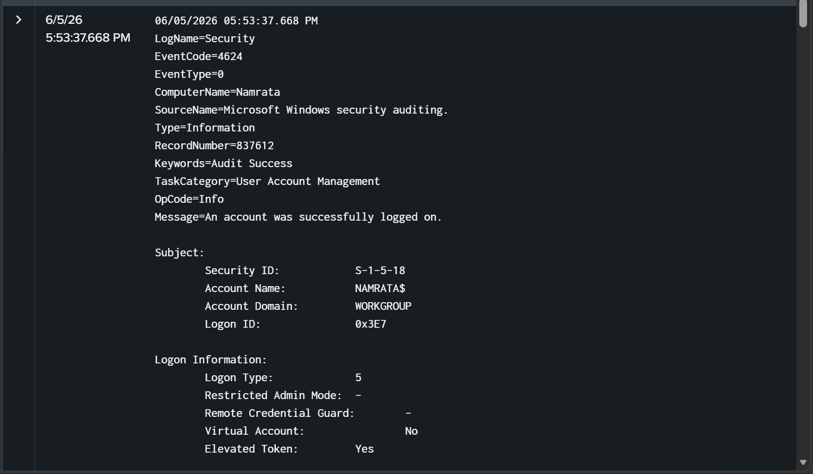
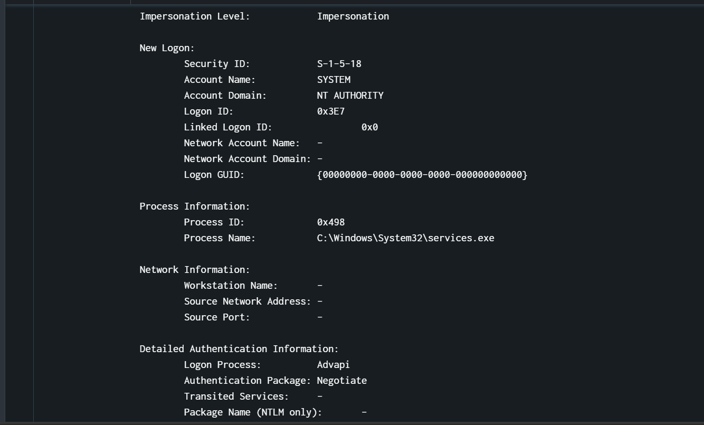

# Successful Login Detection

## Objective
Detect and investigate successful authentication events on Windows systems to identify
the account, logon type, and originating process — and determine whether the login is
legitimate or suspicious.

---

## Event ID
| Event ID | Description |
|----------|-------------|
| 4624 | An account was successfully logged on |

---

## Environment
| Field | Value |
|-------|-------|
| Computer Name | Namrata |
| Domain | WORKGROUP |
| Log Source | Windows Security Log |
| Source Name | Microsoft Windows Security Auditing |
| Keywords | Audit Success |
| Detection Date | 06/05/2026 |
| Record Number | 837612 |

---

## SPL Query

### Basic Detection
```spl
index=* EventCode=4624
| stats count by Account_Name, Logon_Type, Process_Name, ComputerName
| sort - count
```

### Filter by Logon Type (Service Logons)
```spl
index=* EventCode=4624 Logon_Type=5
| table _time, Account_Name, ComputerName, Process_Name, Logon_Type
| sort - _time
```

### Correlate with Failed Logins (Brute-force followed by success)
```spl
index=* EventCode=4625 OR EventCode=4624
| stats count by Account_Name, EventCode
| eval Status=if(EventCode=4624,"Success","Failed")
| table Account_Name, Status, count
```

---

## Real Log Analysis

### What Was Detected
On **06/05/2026 at 05:53:37 PM**, Splunk captured a successful login event on machine
`NAMRATA`, just **2 minutes and 10 seconds** after the 13 failed login attempts against
`testuser` (EventCode 4625 at 05:51:27 PM).

### Log Details
| Field | Value |
|-------|-------|
| EventCode | 4624 |
| Subject Account | NAMRATA$ |
| Subject Domain | WORKGROUP |
| Subject Security ID | S-1-5-18 |
| Logon ID | 0x3E7 |
| Logon Type | 5 (Service Logon) |
| Elevated Token | Yes |
| Impersonation Level | Impersonation |
| New Logon Account | SYSTEM |
| New Logon Domain | NT AUTHORITY |
| New Logon Security ID | S-1-5-18 |
| Process ID | 0x498 |
| Process Name | C:\Windows\System32\services.exe |
| Workstation Name | — |
| Source Network Address | — |
| Authentication Package | Negotiate |
| Logon Process | Advapi |

---


## Logon Type Reference
| Logon Type | Name | Description |
|------------|------|-------------|
| 2 | Interactive | Direct keyboard login at the machine |
| 3 | Network | Login over the network (file share, etc.) |
| 4 | Batch | Scheduled task login |
| 5 | Service | Windows service started by Service Control Manager |
| 7 | Unlock | Workstation unlock |
| 10 | RemoteInteractive | RDP login |
| 11 | CachedInteractive | Cached domain credentials login |

The observed logon type was **5**, indicating the Windows Service Control Manager
authenticated a service account — expected system behavior.

---

## Key Findings
- This event was logged **immediately after** 13 failed login attempts against `testuser`,
  making the timing notable even though the event itself is benign
- **SYSTEM** account (`NT AUTHORITY`) authenticated via `services.exe` — standard Windows
  service startup behavior
- `S-1-5-18` is the well-known SID for the Local System account — highest privilege on
  a Windows machine
- Elevated Token: **Yes** — this session has full administrative privileges
- No external network address or workstation name — confirms this is a purely local,
  internal system event
- Logon GUID is all zeros `{00000000-0000-0000-0000-000000000000}` — normal for local
  service logons, not domain-authenticated sessions

---

## Analysis
This event shows the **SYSTEM** account authenticating through the Windows Service Control
Manager (`services.exe`). This is routine behavior triggered every time Windows starts
a service. However, given that this occurred 2 minutes after repeated failed login attempts,
it is worth confirming the two events are unrelated.

What makes this benign:
- Logon Type 5 is exclusively used by the Service Control Manager
- `services.exe` is the legitimate SCM process at `C:\Windows\System32\services.exe`
- No external source IP or workstation — purely local
- SYSTEM account (`S-1-5-18`) is a built-in Windows identity, not a user-controlled account

What to watch for in similar events:
- Logon Type 5 from an **unexpected process** (not `services.exe`) — potential process spoofing
- SYSTEM logon immediately following failed attempts on the **same machine**
- New services being installed around the same time (Event ID 7045)

---

## MITRE ATT&CK Mapping
| Field | Detail |
|-------|--------|
| Tactic | Defense Evasion / Persistence |
| Technique | T1078 — Valid Accounts |
| Sub-technique | T1078.003 — Local Accounts |
| Platform | Windows |
| Data Source | Windows Security Event Log |

---

## Response Actions
- Verify `services.exe` path is exactly `C:\Windows\System32\services.exe` — malware
  sometimes mimics this name from other directories
- Check Event ID **7045** (new service installed) around the same timestamp to confirm
  no unauthorized service was created
- Cross-reference the timing with the 13 failed `testuser` login attempts at 05:51:27 PM
- Confirm no Logon Type 2 or 10 (interactive/RDP) success events followed the failed attempts
- Monitor for any privilege escalation events (Event ID 4672) linked to Logon ID `0x3E7`

---

## Detection Outcome

| Field | Value |
|-------|-------|
| Status | Benign Activity |
| Confidence | High |
| Requires Escalation | No — unless correlated with suspicious service creation |

The event corresponds to a legitimate Windows service authentication by the SYSTEM account
via `services.exe`. Flagged for documentation due to timing proximity to prior failed login
attempts on the same host.

---

## Status Codes & SID Reference
| Value | Meaning |
|-------|---------|
| S-1-5-18 | Local SYSTEM account |
| S-1-5-19 | Local Service account |
| S-1-5-20 | Network Service account |
| Logon Type 5 | Service Control Manager logon |
| Advapi | Authentication via Windows API (local) |
| Negotiate | Auth package that selects Kerberos or NTLM automatically |


## Investigation Evidence

### Successful Login Event — EventCode 4624


### Authentication & Process Details


---
