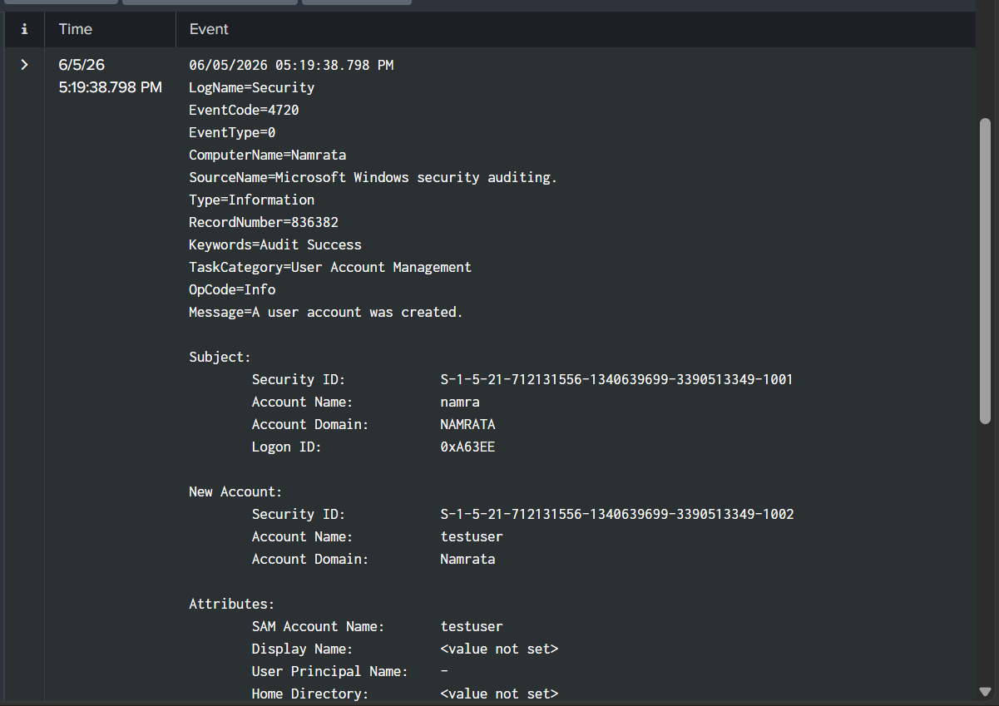
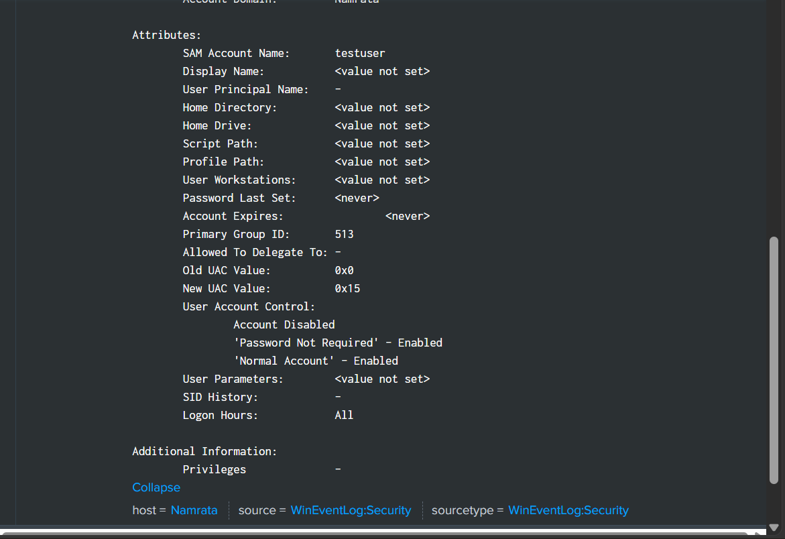

# User Account Creation Detection

## Objective
Detect and investigate the creation of new local user accounts on Windows endpoints to
identify unauthorized account creation that could indicate persistence, privilege
escalation, or insider threat activity.

---

## Event ID & Data Source
| Event ID | Log Source | Description |
|----------|------------|-------------|
| 4720 | Windows Security Log | A user account was created |
| 4722 | Windows Security Log | A user account was enabled |
| 4732 | Windows Security Log | A user was added to a privileged group |

> Monitoring all three together gives a complete picture of account creation and
> privilege assignment activity.

---

## Environment
| Field | Value |
|-------|-------|
| Computer Name | Namrata |
| Domain | NAMRATA |
| Log Source | WinEventLog:Security |
| Source Name | Microsoft Windows Security Auditing |
| Keywords | Audit Success |
| Task Category | User Account Management |
| Detection Date | 06/05/2026 |
| Record Number | 836382 |

---

## SPL Query

### Basic Detection
```spl
source="WinEventLog:Security" EventCode=4720
| table _time, ComputerName, Account_Name, SAM_Account_Name, Message
| sort - _time
```

### Full Account Creation Details
```spl
source="WinEventLog:Security" EventCode=4720
| eval Creator=mvindex(Account_Name,0)
| eval NewAccount=mvindex(Account_Name,1)
| table _time, ComputerName, Creator, NewAccount
| sort - _time
```

### Correlate with Account Enable & Group Add
```spl
source="WinEventLog:Security" EventCode IN (4720, 4722, 4732)
| table _time, EventCode, Account_Name, ComputerName
| sort _time
```

### Check if new account logged in after creation
```spl
source="WinEventLog:Security" EventCode=4624 Account_Name="testuser"
| table _time, Account_Name, Logon_Type, ComputerName
| sort _time
```

---

## Real Log Analysis

### What Was Detected
On **06/05/2026 at 05:19:38 PM**, a new local user account `testuser` was created on
machine `Namrata` by account `namra`. This event occurred **32 minutes before** the
13 failed login attempts against `testuser` at 05:51:27 PM — confirming the account
was freshly created and then immediately targeted.

### Log Details
| Field | Value |
|-------|-------|
| EventCode | 4720 |
| Created By (Subject) | namra |
| Subject Domain | NAMRATA |
| Subject Security ID | S-1-5-21-712131556-1340639699-3390513349-1001 |
| Subject Logon ID | 0xA63EE |
| New Account Name | testuser |
| New Account Domain | Namrata |
| New Account SID | S-1-5-21-712131556-1340639699-3390513349-1002 |
| SAM Account Name | testuser |
| Display Name | \<value not set\> |
| User Principal Name | — |
| Home Directory | \<value not set\> |
| Password Last Set | \<never\> |
| Account Expires | \<never\> |
| Primary Group ID | 513 (Domain Users) |
| Old UAC Value | 0x0 |
| New UAC Value | 0x15 |
| Account Status | Disabled at creation |
| Password Not Required | Enabled |
| Normal Account | Enabled |
| Logon Hours | All |
| Privileges | — |

---

## Key Findings
- Account `testuser` was created by `namra` at **05:19:38 PM** — 32 minutes before
  brute-force attempts against the same account began
- **Password Not Required** flag was enabled (`UAC 0x15`) — this is a significant
  security misconfiguration allowing login without a password
- **Account was created in a disabled state** — attacker may have planned to enable
  it later, or this was a test account setup
- **No Display Name, Home Directory, or Profile Path** set — typical of a quickly
  created backdoor or test account, not a legitimate IT-provisioned account
- **Account never expires** and **password never set** — classic persistence mechanism
- **Primary Group ID 513** = Domain Users — account has standard user privileges
- The full event chain across the lab session:
  - `05:19:38 PM` — `testuser` created by `namra` (Event 4720)
  - `05:51:27 PM` — 13 failed logins against `testuser` (Event 4625)
  - `05:53:37 PM` — SYSTEM service logon on same machine (Event 4624)

---

## UAC Flag Reference
| UAC Value | Meaning |
|-----------|---------|
| 0x0001 | Script |
| 0x0002 | Account Disabled |
| 0x0010 | Lockout |
| 0x0020 | Password Not Required |
| 0x0200 | Normal Account |
| 0x15 (this event) | Disabled + Password Not Required + Normal Account |

---

## Investigation Steps
1. **Identify who created the account** — `namra` on domain `NAMRATA` created `testuser`
2. **Determine timing** — created at 05:19 PM, brute-forced at 05:51 PM on same day
3. **Review UAC flags** — `Password Not Required` is a serious misconfiguration; verify
   if this was intentional
4. **Check group membership** — run Event ID 4732 query to see if `testuser` was added
   to any privileged groups (Administrators, Remote Desktop Users, etc.)
5. **Check for subsequent logons** — use the 4624 SPL query above to verify if `testuser`
   ever successfully logged in
6. **Verify authorization** — confirm with `namra` whether this account creation was
   intentional (lab setup) or unauthorized
7. **Check if account was enabled** — query Event ID 4722 to see if the disabled account
   was later enabled

---

## MITRE ATT&CK Mapping
| Field | Detail |
|-------|--------|
| Tactic | Persistence |
| Technique | T1136 — Create Account |
| Sub-technique | T1136.001 — Local Account |
| Platform | Windows |
| Data Source | Windows Security Event Log |

---

## Response Actions
- Immediately **disable or delete `testuser`** if creation was unauthorized
- Investigate why `Password Not Required` was set — this should never be enabled
  for real accounts
- Check if `testuser` was added to any privileged groups (Event ID 4732)
- Review all actions performed by `namra` around 05:19 PM for signs of compromise
- Audit all local accounts on `Namrata` for other unauthorized accounts
- Set an alert for future Event ID 4720 events to catch new account creation in real time

---

## Detection Outcome
| Field | Value |
|-------|-------|
| Status | Suspicious Activity |
| Confidence | High |
| Requires Escalation | Yes |

A new local account `testuser` was created with no password requirement and no expiry,
then brute-forced 32 minutes later from the same machine. While this is a lab environment
and the account was created intentionally for testing, in a real environment this event
chain — account creation → immediate brute-force → service logon — would constitute a
high-priority incident requiring immediate investigation.

## Investigation Evidence

### User Account Creation — EventCode 4720


### Account Attributes & UAC Flags

