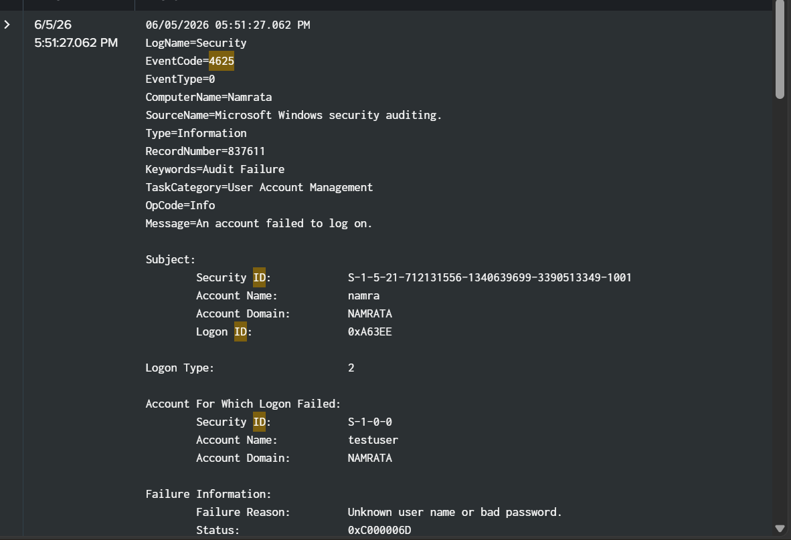
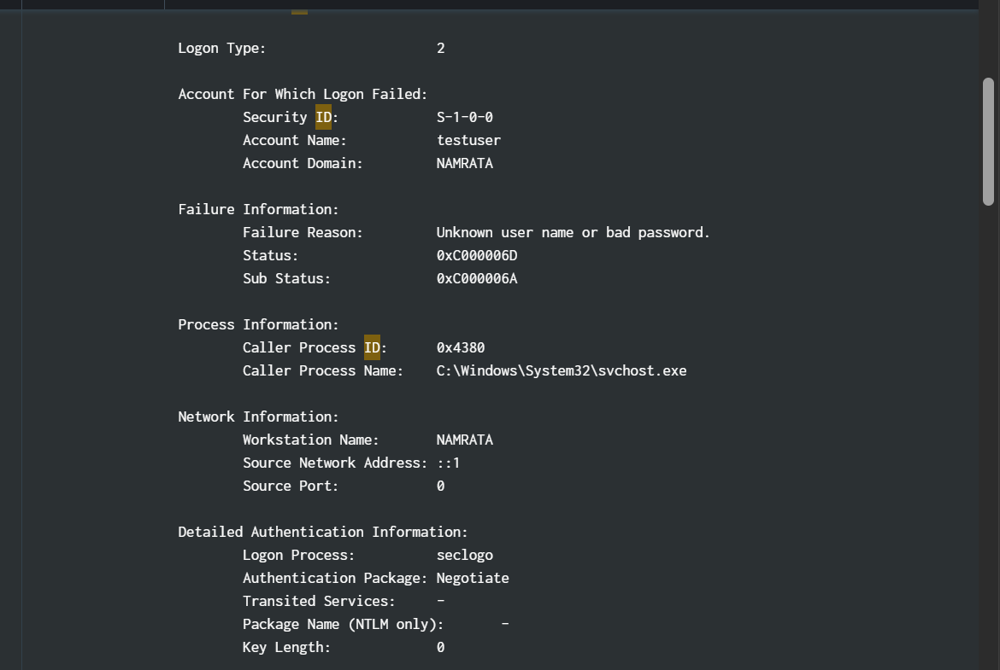
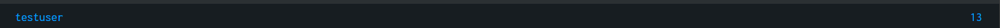

# Failed Login Detection

## Objective
Detect and investigate failed login attempts on Windows endpoints to identify potential
brute-force or credential stuffing attacks.

---

## Event ID
| Event ID | Description |
|----------|-------------|
| 4625 | An account failed to log on |

---

## Environment
| Field | Value |
|-------|-------|
| Computer Name | Namrata |
| Domain | NAMRATA |
| Log Source | Windows Security Log |
| Source Name | Microsoft Windows Security Auditing |
| Detection Date | 06/05/2026 |

---

## SPL Query

### Basic Detection
```spl
index=* EventCode=4625
| stats count by Account_Name, WorkstationName, IpAddress
| sort - count
```

### Brute-Force Threshold Alert (10+ attempts)
```spl
index=* EventCode=4625
| stats count by Account_Name, WorkstationName, IpAddress
| where count >= 10
| sort - count
```

### Timeline View
```spl
index=* EventCode=4625 Account_Name="testuser"
| timechart count span=1m
```

---

## Real Log Analysis

### What Was Detected
On **06/05/2026 at 05:51:27 PM**, Splunk captured a series of failed login attempts
against the account `testuser` on the machine `NAMRATA`.

### Log Details
| Field | Value |
|-------|-------|
| EventCode | 4625 |
| Target Account | testuser |
| Domain | NAMRATA |
| Logon Type | 2 (Interactive) |
| Failure Reason | Unknown user name or bad password |
| Status Code | 0xC000006D |
| Sub Status | 0xC000006A (wrong password, account exists) |
| Caller Process | C:\Windows\System32\svchost.exe |
| Workstation | NAMRATA |
| Source Address | ::1 (localhost / internal) |
| Authentication Package | Negotiate |
| Total Failed Attempts | 13 |

### Log Evidence

#### Event Detail — EventCode 4625


#### Network & Failure Information


#### Failed Attempt Count (testuser = 13 attempts)


---

## Key Findings
- Account `testuser` received **13 failed login attempts** — consistent with brute-force behavior
- Sub-status `0xC000006A` confirms the **account exists** but the password was wrong
- Source address `::1` indicates the login attempts came from **localhost (same machine)**,
  suggesting an insider threat, compromised session, or attacker already on the machine
- Logon Type `2` means an **interactive login** was attempted (not network-based)
- Caller process `svchost.exe` is unusual for interactive logins and warrants further investigation

---

## Investigation Steps
1. **Identify the target account** — `testuser` on domain `NAMRATA` was targeted
2. **Find the source workstation** — origin was `::1` (localhost), meaning internal to the machine
3. **Count failed attempts** — 13 failures detected, exceeding typical brute-force threshold of 5
4. **Check timing** — run the timeline SPL query above to see if attempts were rapid/automated
5. **Correlate with Event ID 4624** — check if any attempt eventually succeeded
6. **Investigate svchost.exe** — verify why `svchost.exe` was the caller process for an interactive login
7. **Check if testuser is a real account** — if it's a test/dummy account, this may indicate
   an attacker probing for weak credentials

---

## MITRE ATT&CK Mapping
| Field | Detail |
|-------|--------|
| Tactic | Credential Access |
| Technique | T1110 — Brute Force |
| Sub-techniques | T1110.001 Password Guessing, T1110.003 Password Spraying |
| Platform | Windows |
| Data Source | Windows Security Event Log |

---

## Response Actions
- Block the source IP if attempts come from external — in this case source is localhost,
  so investigate the machine itself
- Lock the `testuser` account temporarily to stop further attempts
- Investigate why `svchost.exe` is making interactive login attempts
- Check for any successful logins (Event ID 4624) following the failures
- Review all processes running on `NAMRATA` for signs of compromise
- Escalate if attacker presence on the host is confirmed

---

## Status Codes Reference
| Status Code | Meaning |
|-------------|---------|
| 0xC000006D | Wrong username or bad password |
| 0xC000006A | Wrong password, account is correct |
| 0xC0000064 | Username does not exist |
| 0xC000006F | Account login outside authorized hours |
| 0xC0000234 | Account locked out |

## Investigation Evidence



